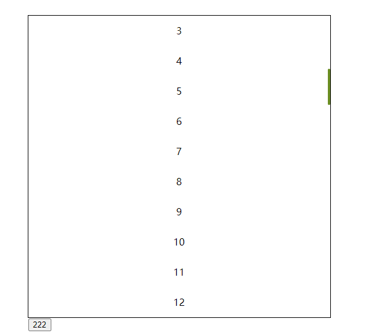
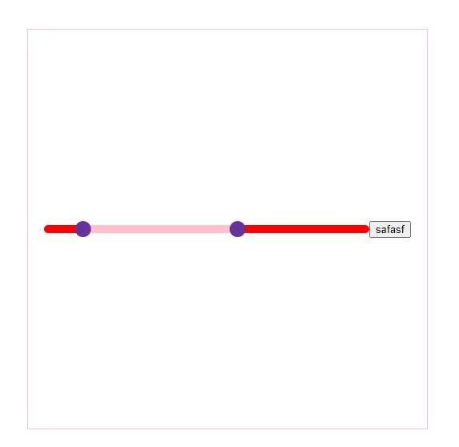

# component

## Project setup

```
pnpm install
```

### Compiles and hot-reloads for development

```
pnpm run serve
```

### Compiles and minifies for production

```
pnpm run build
```

### Customize configuration

See [Configuration Reference](https://cli.vuejs.org/config/).

# 滚动条

**注意事项**

> 一定要使用 "作用域插槽" 不然无法监听盒子的高度

```vue
<template>
  <div class="test">
    <ScrollBox :list="num" v-slot="{ list }">
      <div v-for="item in list" :key="item" class="itme">
        {{ item }}
      </div>
    </ScrollBox>
    <button @click="num = 100">222</button>
  </div>
</template>

<script>
    import ScrollBox from "./index.vue";
    export default {
        data() {
            return {
            num: 20,
            };
        },
        components: {
            ScrollBox,
        },
    };
</script>
```

### 参数

| 参数 | 默认值 | 说明 |
|  --- | --- | ---|
|  list | [ ] |  作用域差错传进去的列表  |
|  color | olivedrab | 滚动条的颜色    |

### 实例



# 滚动条

```vue
<template>
  <div class="container">
    <HuaKuai @change="change" :leftDot="num" ></HuaKuai>
    <button @click="num = 20">safasf</button>
  </div>
</template>

<script>
import HuaKuai from "./index.vue";
export default {
  components: {
    HuaKuai,
  },
  data() {
    return {
      num: 10,
    };
  },
  methods: {
    change(e) {
      console.log(e);
    },
  },
};
```

### 参数

| 参数 | 默认值 | 类型 | 说明 |
|  --- | --- | ---| ---|
|  max | 100 |  number  | 滑块的最大值 |
|  leftDot | 0 | Number    | 左边的小球 |
|  rightDot | 60 |  Number   | 右边的小球|
|  lineColor | pink | string    | 选中线的值； 任意的颜色值 |
|  backColor | red | String    | 总长度的背景颜色 ；任意的颜色值|
|  globlueColor | rebeccapurple | String    | 小球的颜色值; 任意的颜色值|
|  backHeight | 10 | Number    | 线的高度  |
|  globalSize | 20 | Number    | 小球的大小  |

### 事件

| 事件名 | 参数 | 参数说明 |
| --- | -- | -- |
| change | [10, 20] | 返回当前的小球对应的值 |

### 实例


