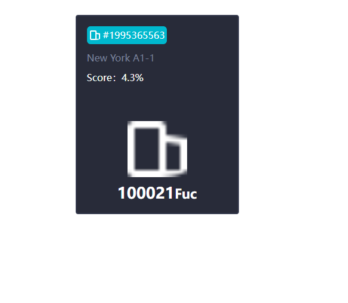

# 小房子

## 参数

|参数名字| 说明| 实列|
|---| ---|--|
| bigImage | 房子大图片| 暂无
| idImage | 小图标| 暂无|
| id | 小图标旁边对应的id| 暂无|
| city | 城市| New York A1-1|
| level | 等级| Score：4.3%|
| price | 价格| 100021|
| priceType | 价格类型| fuc|
| isStuff | 是房子还是材料| 默认值为 false |
|房子的参数---|房子的参数|房子的参数|
| Energy | 当前的能量值| 100|
| Day | 不知道是什么参数| 5000|
| Grade | 星星的个数| 参数为 数字|
|房子的参数结束---|房子的结束|房子的结束|
|材料的参数---|材料的参数|材料的参数|
| UnitPrice | UnitPrice| 参数为 数字 99800|
| Overallprice | Overallprice| 参数为 数字 99800|
| Quantity | Quantity| 参数为 数字 99800|
| Sold | Sold| 参数为 数字 200|
| Surplus | Surplus| 参数为 数字 911|
|材料的参数结束---|材料的结束|材料的结束|
|isMe | 是否显示 撤回出售 默认是为false | false 根据自己的需要去改源码 |

UnitPrice
## 事件

|事件名称| 说明| 实列 |
|---| ---|--|
|saleChange| 点击出售| 参数为 id  isStuff 是楼房，还是材料|
|lookChange| 点击去看看| 参数为 id isStuff|

## 说明

* 此组件需要 包裹一个div div 需要固定高度宽度，组件盛满
