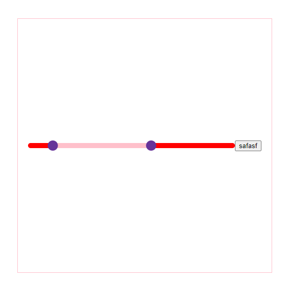

# 滚动条

```
<template>
  <div class="container">
    <HuaKuai @change="change" :leftDot="num" ></HuaKuai>
    <button @click="num = 20">safasf</button>
  </div>
</template>

<script>
import HuaKuai from "./index.vue";
export default {
  components: {
    HuaKuai,
  },
  data() {
    return {
      num: 10,
    };
  },
  methods: {
    change(e) {
      console.log(e);
    },
  },
};
```

#### 参数

| 参数 | 默认值 | 类型 | 说明 |
|  --- | --- | ---| ---|
|  max | 100 |  number  | 滑块的最大值 |
|  leftDot | 0 | Number    | 左边的小球 |
|  rightDot | 60 |  Number   | 右边的小球|
|  lineColor | pink | string    | 选中线的值； 任意的颜色值 |
|  backColor | red | String    | 总长度的背景颜色 ；任意的颜色值|
|  globlueColor | rebeccapurple | String    | 小球的颜色值; 任意的颜色值|
|  backHeight | 10 | Number    | 线的高度  |
|  globalSize | 20 | Number    | 小球的大小  |

#### 实例


