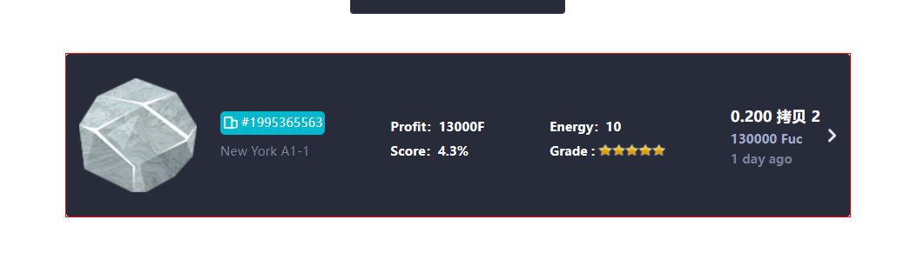

# 长房子

## 说明

* 此组件需要 包裹一个div div 需要固定高度宽度，组件盛满
* 事件你可以不用；自己绑定一个事件放在 包裹div上
* 他没有边框，你需要自己加

## 参数

|参数名字| 说明| 实列|
|---| ---|--|
| bigImage | 大图片 | 暂无 |
| id |  小图标上面的文字 | #1995365563 |
| idImage | 小图标| 暂无|
| Profit | 第二行的第一个| Profit：13000F|
| Score | 第二行的第二个| Score：4.3%|
| Energy | 第三行的第一个| Energy：10|
| Grade | 小行星的个数| 5 |
| isStuff | 是否是材料| 默认值为房子 false|
| threeDown | 第三行的第二个 ，  不是房子后显示的| Crazy dinerbiu|
| fourOne | 第四行的第一个| 0.200|
| fourTow | 第四行的第二个| 130000 Fuc|
| fourThree | 第四行的第三个| 1 day ago|
| threeColor | 设置第三个上面的颜色| 默认是为白色|
| threeColor1 | 设置第三个下面的颜色| 默认是为白色|

## 事件

|事件名称| 说明| 实列 |
|---| ---|--|
|lookEvent| 点击列表触发| 参数为 id 和 isStuff|
